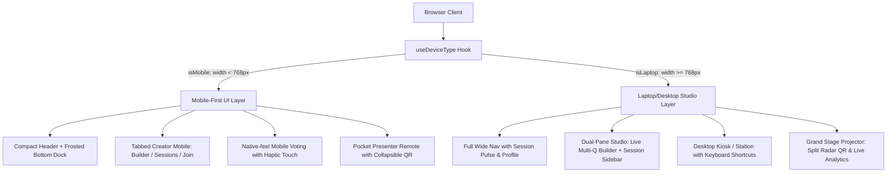

# Implementation Plan: Comprehensive Multi-Device Responsive Architecture (Laptop vs Mobile UI)

Optimize PulseCast for all devices by providing dedicated, tailored UI/UX experiences for both laptops/desktops and mobile devices across all key screens: Navigation, Creator Studio, Mobile Voting, and Presentation/Projector.

## Proposed Architecture

## User Review Required

> [!NOTE]
> - **Zero Disruption**: Existing URL routing (`/`, `/present/:id`, `/vote/:id`, `/vote`) is 100% preserved.
> - **Auto-Adaptive**: Device detection is dynamic based on window dimensions and touch sensors, seamlessly switching if a user resizes or rotates their screen.
> - **Bottom Navigation**: Mobile screens gain an app-like floating bottom dock for one-thumb reachability, with safe-area padding for modern iOS and Android home bars.

---

## Proposed Changes

### 1. Device Sensing & Global Responsive Utilities
#### [NEW] [frontend/src/hooks/useDeviceType.js](file:///d:/PulseCast/frontend/src/hooks/useDeviceType.js)
- Responsive hook listening to viewport resize with debouncing.
- Exports `{ isMobile, isTablet, isLaptop, isTouch, deviceType, width }`.
- Standard breakpoints: Mobile (`< 768px`), Tablet (`768px - 1024px`), Laptop (`>= 1024px`).

#### [MODIFY] [frontend/src/index.css](file:///d:/PulseCast/frontend/src/index.css)
- Add mobile-first utilities:
  - `.mobile-only` (`display: block` under 768px, `none` above).
  - `.desktop-only` (`display: none` under 768px, `block` above).
  - Safe-area inset variables for mobile notch & home indicator (`env(safe-area-inset-bottom)`).
  - Dynamic viewport units (`100dvh`) to prevent address-bar jumps on iOS Safari and Android Chrome.
  - Large touch targets (min 44px) for mobile buttons and option chips.
  - Mobile bottom navigation bar styling with glassmorphism.

---

### 2. Navigation Shell
#### [NEW] [frontend/src/components/MobileBottomNav.jsx](file:///d:/PulseCast/frontend/src/components/MobileBottomNav.jsx)
- Mobile-specific floating bottom dock with glassmorphism:
  - `Vote` (Smartphone icon)
  - `Create` (PlusCircle icon)
  - `Projector` (Presentation icon)
  - `Account` (User icon)
- Subtle active glow and safe-area margin.

#### [MODIFY] [frontend/src/components/Header.jsx](file:///d:/PulseCast/frontend/src/components/Header.jsx)
- On **Laptop**: Keep rich top bar with full logo, live ping indicator, desktop nav pills, user profile avatar and logout.
- On **Mobile**: Compact header with minimal height (52px), streamlined title and connection status badge, freeing 80% more screen real estate for content.

---

### 3. Creator Dashboard (Studio)
#### [MODIFY] [frontend/src/pages/CreatorDashboard.jsx](file:///d:/PulseCast/frontend/src/pages/CreatorDashboard.jsx)
- **Laptop UI**:
  - Dual-column studio layout:
    - Left/Main (65% width): Multi-Question Poll Studio with interactive question cards, drag/reorder preview, template quick-starters.
    - Right (35% width sidebar): "My Polling Sessions" manager with live participation counters, quick-action projector launch, copy QR link, and delete session.
- **Mobile UI**:
  - Mobile-first segmented control:
    - Tab 1: `Poll Builder` (Full-width touch inputs, swipeable question selector, bottom sticky "Launch Poll" button).
    - Tab 2: `My Sessions` (Touch-friendly card list with one-tap Projector, Copy Link, and Delete).
    - Tab 3: `Join / Test` (Instant PIN/Session entry).
  - Unauthenticated Auth Card: Seamless 100% width card with Google OAuth button and tab toggle without horizontal scroll.

---

### 4. Mobile Voting Screen
#### [MODIFY] [frontend/src/pages/MobileVotingScreen.jsx](file:///d:/PulseCast/frontend/src/pages/MobileVotingScreen.jsx)
- **Laptop Experience ("Desktop Polling Kiosk")**:
  - Wide centered 2-column card layout:
    - Left: Active Question, options with keyboard shortcuts (`1`, `2`, `3`, `4`, `Enter`).
    - Right: Session details, presenter link, real-time voter pulse indicator, and animated tips.
- **Mobile Experience ("Native Touch App")**:
  - Full-screen height (`100dvh`), prominent question progress stepper (`Question 2 of 4`).
  - Tactile option buttons (min-height 56px) with instant visual feedback and checkmark.
  - Sticky bottom vote confirmation bar.

---

### 5. Live Presentation Screen
#### [MODIFY] [frontend/src/pages/PresentationView.jsx](file:///d:/PulseCast/frontend/src/pages/PresentationView.jsx)
- **Laptop / Projector Mode**:
  - Split stage view with radar-pulsing QR code, scannable instructions, big vote percentages, and real-time live bars.
- **Mobile Presenter Remote Mode**:
  - When opened on a mobile device, provides a **Presenter Remote Control**:
    - Floating / expandable QR code preview sheet.
    - Large tactile presentation controls (`[Next Question]`, `[Lock Poll]`, `[Show Leaderboard]`).
    - Live audience headcount and connection status for the host in the palm of their hand.

---

## Verification Plan

### Automated / Code Validation
- Check JavaScript and JSX syntax for all modified and new components.
- Verify that `useDeviceType` hook properly handles SSR/initial render and window resize listeners.

### Multi-Device Verification
1. **Desktop/Laptop Viewports (>=1024px)**:
   - Verify Header shows full navigation items.
   - Verify Creator Studio displays dual-column layout.
   - Verify Voting screen provides desktop kiosk layout with keyboard hints.
   - Verify Presentation screen displays grand stage 2-column layout.
2. **Mobile Viewports (<768px)**:
   - Verify compact top header + floating bottom navigation bar appear.
   - Verify Creator Studio displays tabbed segmented interface with thumb-friendly controls.
   - Verify Mobile Voting screen fits 100dvh without awkward horizontal scroll.
   - Verify Presentation View adapts to Presenter Remote mode.
