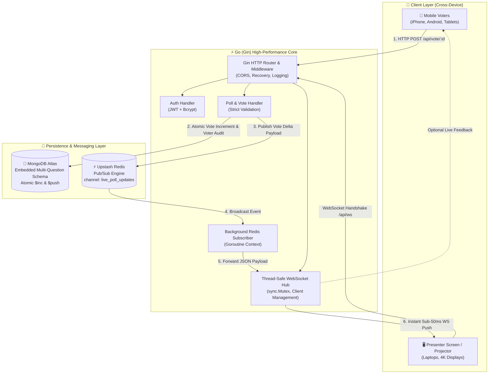
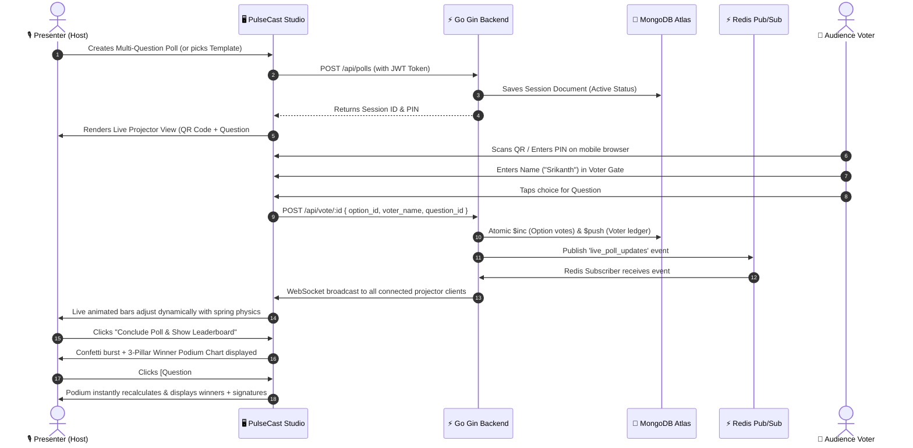

# 🗳️ PulseCast — Real-Time Live Polling Engine

> **High-Performance Distributed Polling System with Physical Ballot Aesthetics, Sub-50ms Live Sync, and Interactive Winner Podium Charts.**

**Developer:** **Srikanth R**  
**Core Stack:** Go (Gin) • Redis (Upstash) • MongoDB (Atlas) • Gorilla WebSockets • React 18 • Framer Motion

---

## 📋 Table of Contents

1. [Overview & Highlights](#-overview--highlights)
2. [System Architecture](#-system-architecture)
3. [End-to-End User Flow](#-end-to-end-user-flow)
4. [Real-Time WebSocket & Pub/Sub Flow](#-real-time-websocket--pubsub-flow)
5. [Key Features](#-key-features)
6. [Tech Stack Breakdown](#-tech-stack-breakdown)
7. [Directory Structure](#-directory-structure)
8. [Getting Started & Local Setup](#-getting-started--local-setup)
9. [API Reference](#-api-reference)
10. [Multi-Device Responsiveness](#-multi-device-responsiveness)
11. [Author](#-author)

---

## 🌟 Overview & Highlights

**PulseCast** is an enterprise-grade live polling and audience interaction platform designed for keynotes, workshops, tech conferences, and classrooms. Presenters can create multi-question interactive polls and project live, animated bar charts and QR codes onto a main stage. Audience members simply scan the QR code on their smartphones (or join via session PIN) to cast verified votes in real-time without installing any app.

### 🏛️ The "Vintage Ballot Box" Brutalist Paper Aesthetic
PulseCast blends state-of-the-art distributed systems performance with a tactile brutalist paper theme:
- **Paper Parchment Textures:** Physical `#F4F1EA` parchment background with `#FAFAFA` ballot white cards.
- **Sharp Geometry:** Clean 90-degree paper corners with stark ink black drop shadows.
- **Official Rubber Stamps:** Distressed crimson (`#DC2626`) "★ WINNER ★" and "RECORDED" seals.
- **Typewriter & Handwriting Typography:** Built with `'Special Elite'` typewriter monospace and `'Caveat'` cursive signatures for registered voters.

---

## 🏗️ System Architecture



---

## 🔄 End-to-End User Flow



---

## ⚡ Real-Time WebSocket & Pub/Sub Flow

PulseCast implements a zero-polling reactive architecture capable of scaling across multiple server replicas:

```
[ Audience Smartphone ]
         │
         │  1. HTTP POST /api/vote/:id { option_id, voter_name, question_index }
         ▼
┌────────────────────────────────────────────────────────┐
│                   Go Gin Backend API                   │
│                                                        │
│  • Validates session is not concluded                  │
│  • Executes atomic MongoDB $inc vote count             │
│  • Appends voter to audit guestbook                    │
└───────────────────────┬────────────────────────────────┘
                        │
                        │ 2. redisClient.Publish("live_poll_updates", payload)
                        ▼
┌────────────────────────────────────────────────────────┐
│            Upstash Redis Server (Pub/Sub)              │
│       Channel: "live_poll_updates"                     │
└───────────────────────┬────────────────────────────────┘
                        │
                        │ 3. Fan-out to all subscribed backend workers
                        ▼
┌────────────────────────────────────────────────────────┐
│          Go Redis Subscriber (Goroutine)               │
│                                                        │
│  • Subscribes on application boot                      │
│  • Marshals update payload                             │
│  • Calls ws.GlobalHub.Broadcast(message)               │
└───────────────────────┬────────────────────────────────┘
                        │
                        │ 4. Thread-Safe sync.Mutex WebSocket Broadcast
                        ▼
┌────────────────────────────────────────────────────────┐
│         Projector Screen / Audience Phones             │
│                                                        │
│  • Receives JSON payload in < 50ms                     │
│  • Framer Motion re-animates bars smoothly             │
│  • Guestbook updates with cursive voter signatures     │
└────────────────────────────────────────────────────────┘
```

---

## ✨ Key Features

### 1. 🏆 3-Pillar Winner Podium Chart per Question
- **1st Place (Center)**: Tallest Pillar in bold crimson (`#DC2626`) crowned with Trophy icon and `★ WINNER ★` rubber stamp.
- **2nd Place (Left)**: Charcoal black (`#2B2B2B`) pillar showing runner-up choice, vote count, and percentage.
- **3rd Place (Right)**: Warm parchment (`#EBE7DD`) pillar showing third-place winner.
- **Interactive Question Switchers**: Dedicated interactive buttons `[ Question #1 ]`, `[ Question #2 ]`, and `[ ★ Overall Session Podium ]` allow presenters and voters to toggle between question results instantly.
- **Runners-Up Roster**: Ranked display for choices #4, #5, etc., complete with percentage progress bars.
- **Participant Guestbook**: Real-time cursive signatures (`'Caveat'` font) signed onto each winning choice.

### 2. 📱 Multi-Device Usability & Responsiveness
- **iOS Safari Auto-Zoom Prevention**: Strict `16px` font sizing on mobile inputs guarantees Safari never zooms or shifts the screen layout upon touch.
- **Fluid Pillar Scaling**: Proportional flex widths (`maxWidth: 31% / 36% / 31%`) with `minWidth: 0` eliminate horizontal overflow on narrow screens (down to 320px).
- **2-Line Text Wrapping**: Dynamic vertical line clamping (`-webkit-line-clamp: 2`) ensures long option titles (e.g. *"WebSockets Real-time Streaming"*) wrap cleanly without truncating.
- **Tablet Adaptive Grid (1024px)**: Presentation split screen gracefully stacks on tablets (e.g., iPad, Surface Pro) so QR code and chart remain large and legible.
- **Touch-First Ergonomics**: Interactive targets adhere to standard touch targets (min 42px) with horizontal swipe support.

### 3. 🛡️ Creator Authentication & Session Management
- **Host Sign Up & Login**: Secure password hashing with `bcrypt` and signed JWT authentication tokens.
- **Google OAuth Integration**: Instant sign-in via Google Identity Services.
- **Session History**: Creator dashboard tracks all past, live, and concluded sessions with direct project, share, and delete controls.

---

## 💻 Tech Stack Breakdown

| Layer | Technology | Key Capabilities |
| :--- | :--- | :--- |
| **Frontend Framework** | **React 18 + Vite** | High-speed HMR, client-side routing, and modular components |
| **Styling System** | **Vanilla CSS + Brutalist Design Tokens** | Tactile 90° borders, SVG turbulence parchment noise, custom scrollbars |
| **Animations** | **Framer Motion + Canvas Confetti** | Physics-based spring animations and celebratory victory confetti |
| **QR Code Engine** | **qrcode.react** | Crisp vector SVG QR codes with instant mobile routing |
| **Backend Core** | **Go 1.21+ (Gin Engine)** | Low-latency compiled REST API with CORS and proxy handling |
| **WebSockets** | **Gorilla WebSocket** | Thread-safe connection hub (`sync.Mutex`), auto-reconnect, ping/pong |
| **Database** | **MongoDB Atlas** | Document store with atomic `$inc` updates and single-query reads |
| **Pub/Sub Broker** | **Redis (Upstash)** | Distributed Pub/Sub channel for multi-instance realtime synchronization |
| **Authentication** | **JWT (golang-jwt) + Bcrypt** | 24-hour signed JWT tokens and cryptographically secure passwords |

---

## 📁 Directory Structure

```
PulseCast/
├── backend/
│   ├── config/             # Database (MongoDB) and Cache (Redis) connectors
│   ├── handlers/           # HTTP handlers (Auth, Polls, Votes, Results)
│   ├── middleware/         # CORS and JWT Authentication middleware
│   ├── models/             # Go structs (User, Poll, Question, Option, Voter)
│   ├── ws/                 # WebSocket Hub & Redis Pub/Sub subscriber goroutines
│   ├── main.go             # Backend entry point and routing table
│   └── go.mod              # Go dependencies
│
├── frontend/
│   ├── public/             # Static assets and favicon
│   ├── src/
│   │   ├── api/            # Centralized fetch client (Auth, Polls, Voting)
│   │   ├── components/     # UI Components
│   │   │   ├── PodiumChart.jsx       # 3-Pillar Winner Podium Chart
│   │   │   ├── Leaderboard.jsx       # Final results & Question switchers
│   │   │   ├── AnimatedBar.jsx       # Live spring-physics progress bars
│   │   │   ├── Navbar.jsx            # Top navigation bar
│   │   │   └── TypewriterText.jsx    # Typewriter character rendering
│   │   ├── hooks/          # Custom hooks (useLivePoll, useDeviceType)
│   │   ├── pages/          # Full-page views
│   │   │   ├── LandingPage.jsx        # Landing info & feature showcase
│   │   │   ├── CreatorDashboard.jsx   # Poll builder & session management
│   │   │   ├── PresentationView.jsx   # Projector view & QR display
│   │   │   └── MobileVotingScreen.jsx # Voter screen & ballot box
│   │   ├── App.jsx         # App router configuration
│   │   ├── index.css       # Brutalist paper theme & responsive rules
│   │   └── main.jsx        # Frontend entry point
│   ├── index.html          # HTML5 container with Google Fonts
│   ├── package.json        # Frontend dependencies & scripts
│   └── vite.config.js      # Vite build configuration
│
└── README.md               # Documentation & Architecture Guide
```

---

## 🚀 Getting Started & Local Setup

### Prerequisites
- **Node.js** (v18 or higher)
- **Go** (v1.21 or higher)
- **MongoDB** (Atlas connection string or local MongoDB instance)
- **Redis** (Upstash Redis or local Redis instance)

---

### 1. Backend Setup

1. Navigate to the backend directory:
   ```bash
   cd backend
   ```

2. Create a `.env` file (or set environment variables):
   ```env
   PORT=8080
   MONGODB_URI=mongodb+srv://<username>:<password>@cluster.mongodb.net/pulsecast?retryWrites=true&w=majority
   REDIS_URL=rediss://default:<token>@<host>.upstash.io:6379
   JWT_SECRET=your_super_secret_jwt_key_2026
   ```

3. Download dependencies and run:
   ```bash
   go mod tidy
   go run main.go
   ```
   The backend will start at: `http://localhost:8080`.

---

### 2. Frontend Setup

1. Navigate to the frontend directory:
   ```bash
   cd frontend
   ```

2. Install dependencies:
   ```bash
   npm install
   ```

3. Configure environment in `.env`:
   ```env
   VITE_API_URL=http://localhost:8080/api
   VITE_WS_URL=ws://localhost:8080/api/ws
   ```

4. Launch Vite development server:
   ```bash
   npm run dev
   ```
   The application will be accessible at: `http://localhost:5173`.

---

## 📡 API Reference

### Health Check
- `GET /health` — Returns status of backend, Redis connection state, and active WebSocket clients count.

### Authentication
- `POST /api/auth/signup` — Register a new host account (`name`, `email`, `password`).
- `POST /api/auth/login` — Sign in and receive a 24-hour signed JWT bearer token.
- `POST /api/auth/google` — Authenticate using a Google OAuth identity credential.

### Poll Operations
- `GET /api/polls` — Retrieve all polls created by the authenticated user.
- `POST /api/polls` — Create a new multi-question poll session *(Requires Bearer Token)*.
- `GET /api/polls/:id` — Fetch live poll details, questions, current vote counts, and voter names.
- `PATCH /api/polls/:id/status` — Conclude or reopen a poll session (`"active"` | `"completed"`).
- `DELETE /api/polls/:id` — Permanently delete a poll session and its vote audit trail.

### Voting
- `POST /api/vote/:id` — Cast an atomic vote for a question option:
  ```json
  {
    "option_id": "opt_123",
    "voter_name": "Srikanth",
    "question_id": "q_1"
  }
  ```

### Realtime
- `GET /api/ws` — Gorilla WebSocket endpoint for live real-time bidirectional voting streams.

---

## 📱 Multi-Device Responsiveness

| Screen Type | Viewport Width | Optimized Layout Behavior |
| :--- | :--- | :--- |
| **Mobile Phones** | `320px – 480px` | Single-column ballot, 16px iOS inputs, fluid podium pillars (`31%/36%/31%`), touch swipe controls |
| **Large Phones / Phablets** | `481px – 767px` | Spaced touch targets (min 42px), horizontal question scrolling, 2-line title clamping |
| **Tablets / iPads** | `768px – 1024px` | Stacks projector grid vertically to maintain large readable QR code and full-width bars |
| **Laptops / Ultrabooks** | `1025px – 1440px` | 2-column split presentation screen, sticky controls, full participant guestbook |
| **Desktops & 4K Projectors** | `1441px+` | High-contrast presentation layout, crisp SVG vector rendering, large-format typography |

---

## 👨‍💻 Author

**Srikanth R**  
*Full-Stack Engineer & Distributed Systems Enthusiast*  
- **Project**: PulseCast Live Polling Platform  
- **Year**: 2026  
- **License**: MIT License

---

*Made with precision, tactile brutalist craftsmanship, and high-concurrency Go engineering.*
